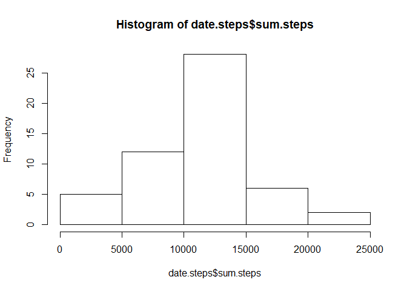
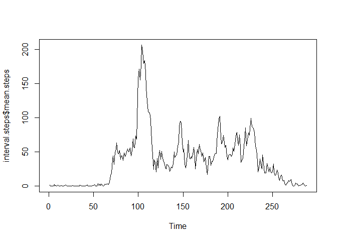
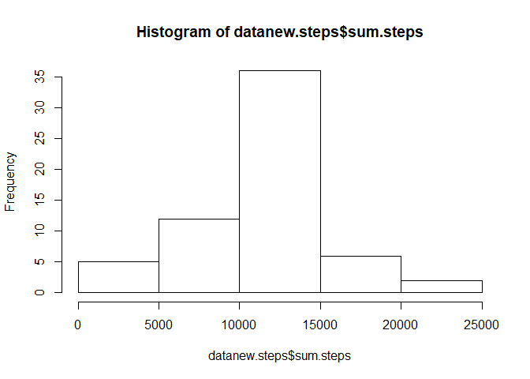

## Loading and preprocessing the data

```r
library(plyr)
library(lattice)
activity<- read.csv("activity.csv")
activity$date = as.Date(as.character(activity$date), "%Y-%m-%d")
clean<-na.omit(activity)
date.steps <- ddply(clean, "date", summarise, sum.steps = sum(steps))
```


## What is mean total number of steps taken per day?

```r
hist(date.steps$sum.steps)
```

<!-- -->

```r
mean(date.steps$sum.steps)
```

```
## [1] 10766.19
```

```r
median(date.steps$sum.steps)
```

```
## [1] 10765
```


## What is the average daily activity pattern?

```r
interval.steps <- ddply(clean, "interval", summarise, mean.steps = mean(steps))

#Make a time series plot (i.e. type = "l") of the 5-minute interval (x-axis) and the average number of steps taken, averaged across all days (y-axis)
ts.plot(interval.steps$mean.steps)
```

<!-- -->

```r
#Which 5-minute interval, on average across all the days in the dataset, contains the maximum number of steps?
interval.steps[which.max(interval.steps$mean.steps),]
```

```
##     interval mean.steps
## 104      835   206.1698
```


## Imputing missing values

```r
#Calculate and report the total number of missing values in the dataset (i.e. the total number of rows with NAs)
sum(is.na(activity))
```

```
## [1] 2304
```

```r
#Devise a strategy for filling in all of the missing values in the dataset.
naIdx = which(is.na(activity$steps))
naInt = activity[naIdx, 3]
impute = sapply(naInt, function(x) { interval.steps[(interval.steps$interval==x),2]})

#Create a new dataset that is equal to the original dataset but with the missing data filled in.
datanew=activity
datanew[naIdx, 'steps'] = impute
datanew.steps<-ddply(datanew, 'date', summarise, sum.steps=sum(steps))
hist(datanew.steps$sum.steps)
```

<!-- -->

```r
#Calculate and report the mean and median total number of steps taken per day
mean(datanew.steps$sum.steps)
```

```
## [1] 10766.19
```

```r
median(datanew.steps$sum.steps)
```

```
## [1] 10766.19
```


## Are there differences in activity patterns between weekdays and weekends?

```r
#Create a new factor variable in the dataset with two levels -- "weekday" and "weekend" indicating whether a given date is a weekday or weekend day.
datanew$date = as.Date(as.character(datanew$date), "%Y-%m-%d")
datanew['dateIs'] = factor(sapply(datanew$date, function(x){ if (weekdays(x) == "Sunday" | weekdays(x) == "Saturday") { "weekend" } else { "weekday"} }))

#Make a panel plot containing a time series plot (i.e. type = "l") of the 5-minute interval (x-axis) and the average number of steps taken, averaged across all weekday days or weekend days (y-axis).
avgIntervalDateIs <- aggregate(steps~interval + dateIs, mean, data=datanew)
xyplot( steps ~ interval | dateIs, data = avgIntervalDateIs, type="l", layout=c(1,2), xlab="Interval", ylab="Number of steps")
```

<!-- -->

